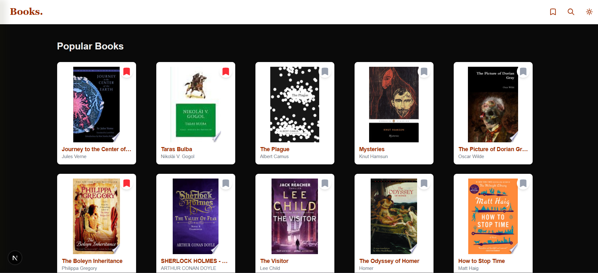
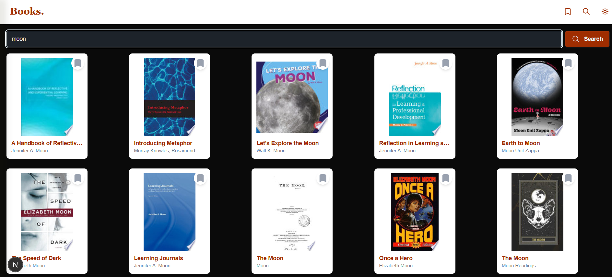
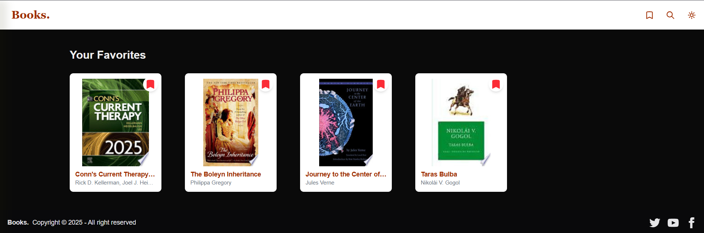

# Book Explorer Application

A simple Book Explorer application built with Next.js, Tanstack Query, and Tailwind CSS. The app allows users to browse, search, and save their favorite books using the Google Books API.

## Features
- **Home Page**: Displays a grid of popular books.
- **Book Detail Page**: Shows detailed information about a specific book.
- **Search Page**: Lets users search for books by title or author.
- **Favorites Page**: Allows users to view their marked favorite books.

## Tech Stack
- **Next.js** (App Router)
- **Tanstack Query** (API Calls)
- **Tailwind CSS** (Styling)

## Pages

### Home Page (`/`)
Displays a grid of popular books fetched from the Google Books API.

### Book Detail Page (`/books/[id]`)
Shows detailed information about a specific book, including title, author, description, and more.

### Search Results Page (`/search`)
Allows users to search for books by title or author, displaying the results dynamically.

### Favorites Page (`/favorites`)
Displays a list of books that the user has marked as favorites.

### API
The app uses the [Google Books API](https://developers.google.com/books) for fetching book data:
- **Search Books**: `https://www.googleapis.com/books/v1/volumes?q=SEARCH_TERM`
- **Book Details**: `https://www.googleapis.com/books/v1/volumes/BOOK_ID`

### License
- This project is open source and available under the MIT License.

